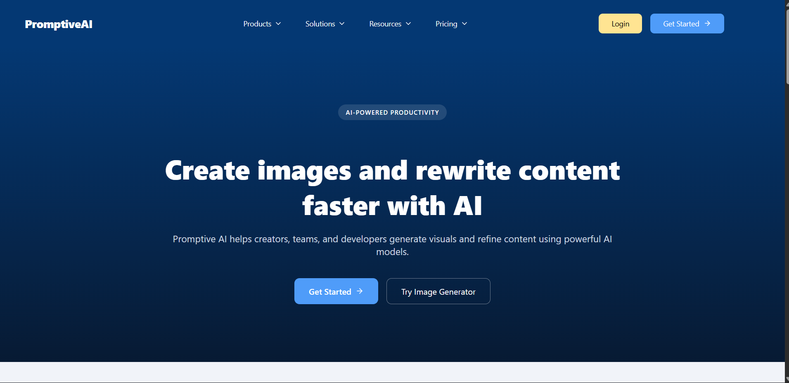
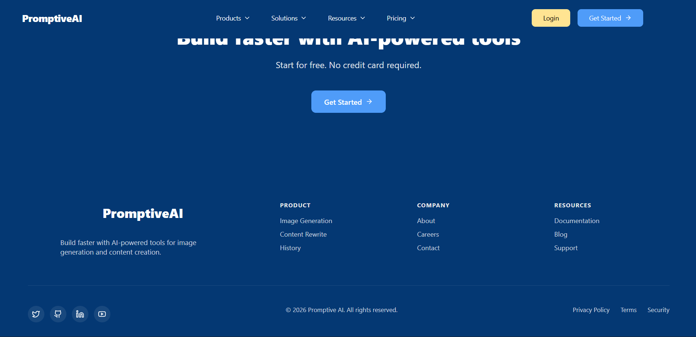
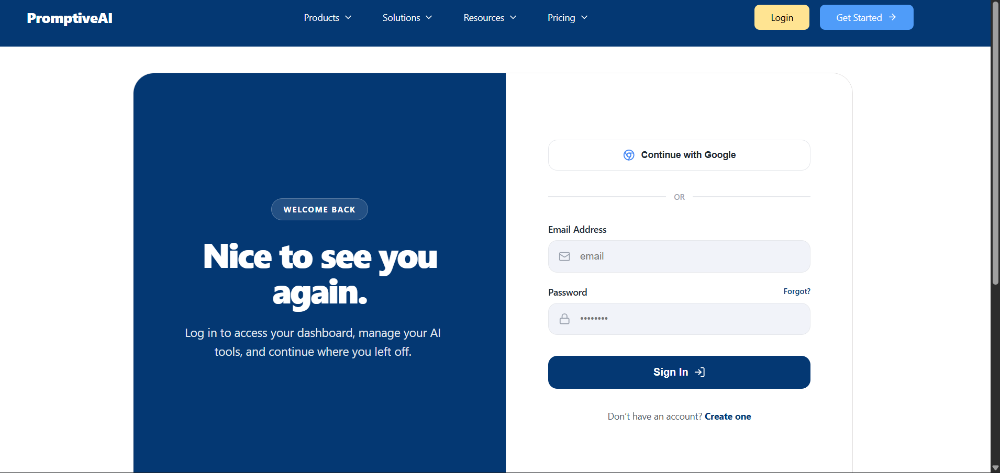
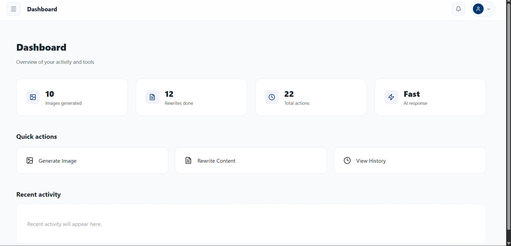
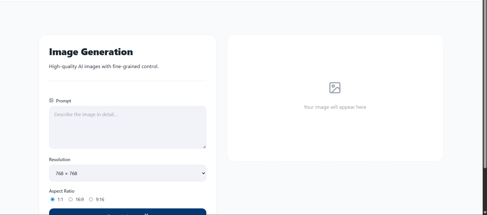
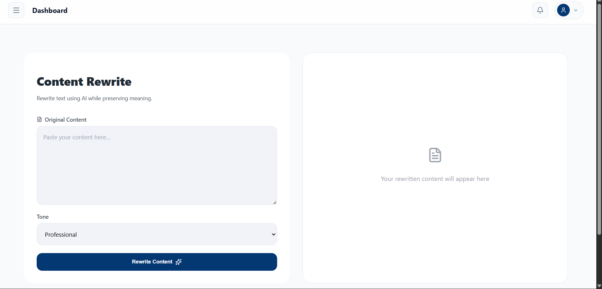
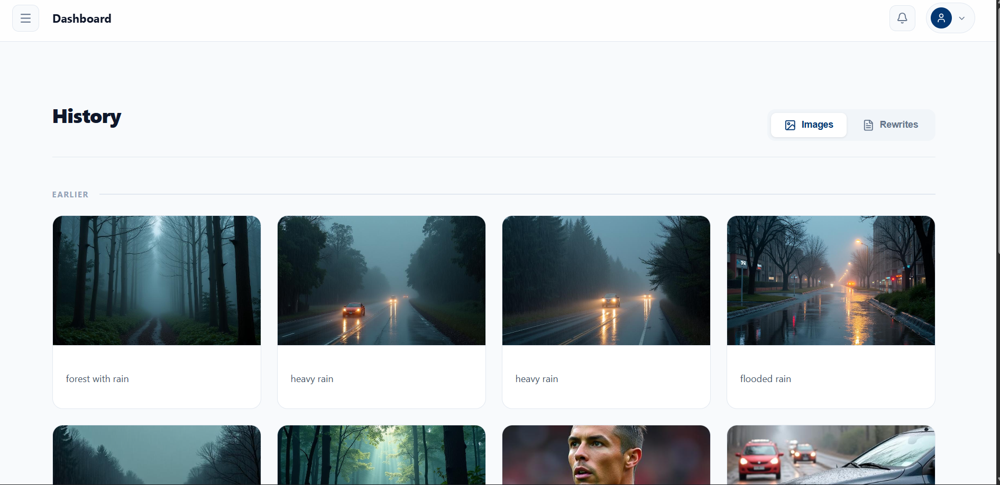

# Promptive AI

AI image generation and content rewriting SaaS.

Promptive AI is a full-stack application that lets users generate AI images,
rewrite content in different tones, and manage their work through a secure
dashboard.

---

## Features

### Authentication
- Email/password sign-up and sign-in
- Sign in with Google (OAuth 2.0)
- JWT tokens, attached to requests via an Axios interceptor
- Public routes, protected routes, automatic redirect on 401

### AI capabilities
- **Image generation** — text-to-image via Hugging Face FLUX.1 with selectable
  resolution and aspect ratio. Generated images are uploaded to Cloudinary.
- **Content rewrite** — Google Gemini rewrites your text in `professional`,
  `formal`, `casual`, or `creative` tone while preserving meaning.

### Dashboard
- Overview with real per-user counts and last-activity timestamp
- Image generation, content rewrite, and history pages
- Sidebar + topbar with mobile drawer

### History
- Per-user history for both image and rewrite outputs
- Grouped by Today / Yesterday / Earlier
- Copy rewritten text, download images, delete items

---

## Tech stack

### Frontend
React 19 (Vite), React Router 7, React Hook Form + Zod, Axios,
Framer Motion, Lucide React, Tailwind CSS v4.

### Backend
Node.js, Express 5, MongoDB (Mongoose), JWT, Helmet, express-rate-limit,
Morgan, Multer, Bcrypt, Cloudinary SDK, `@google/genai`,
`@huggingface/inference`, `google-auth-library`.

---

## Repository layout

```text
promptive-ai
├── backend
│   ├── auth/         # JWT + role middleware
│   ├── config/       # env loader, db, cloudinary, AI clients
│   ├── controller/   # request handlers
│   ├── model/        # Mongoose schemas (User, Image, Content)
│   ├── view/         # Express routers
│   ├── index.js      # app bootstrap
│   ├── package.json
│   └── .env.example
│
├── frontend
│   ├── src/
│   │   ├── api/         # axios client + per-resource calls
│   │   ├── animations/  # fade-in scroll observer
│   │   ├── components/  # Navbar, Footer, ServerLoadingScreen
│   │   ├── dashboard/   # DashboardLayout, Sidebar, Topbar, pages
│   │   ├── pages/       # public + auth + protected pages
│   │   ├── routes/      # ProtectedRoute, PublicRoute
│   │   ├── utils/       # auth helpers, zod schemas
│   │   ├── App.jsx
│   │   └── main.jsx
│   ├── public/
│   ├── index.html
│   ├── vite.config.js
│   └── .env.example
│
└── README.md
```

---

## Getting started

### Prerequisites
- Node.js 18+
- A MongoDB connection string
- Cloudinary, Google Gemini, and Hugging Face API keys
- Optional: Google OAuth client (for Sign in with Google)

### Backend

```bash
cd backend
cp .env.example .env       # fill in values
npm install
npm run dev                # nodemon on port 5000 (default)
```

The server fails fast at boot if any required env var is missing,
listing exactly which ones.

### Frontend

```bash
cd frontend
cp .env.example .env       # set VITE_API_BASE_URL=http://localhost:5000
npm install
npm run dev                # Vite on port 5173
```

---

## Environment variables

See `backend/.env.example` and `frontend/.env.example` for the canonical lists.

**Backend (required):**
`MONGO_URI`, `SECRET_KEY` (JWT), `CLOUDINARY_CLOUD_NAME`,
`CLOUDINARY_API_KEY`, `CLOUDINARY_API_SECRET`, `GEMINI_API_KEY`,
`HUGGINGFACE_API_KEY`.

**Backend (optional):**
`PORT` (default `5000`), `NODE_ENV`, `FRONTEND_URL`, `BACKEND_URL`,
`GOOGLE_CLIENT_ID`, `GOOGLE_CLIENT_SECRET`.

**Frontend:**
`VITE_API_BASE_URL` — base URL of the backend (e.g. `http://localhost:5000`).

---

## Routes

### Public
| Path                | Page                          |
| ------------------- | ----------------------------- |
| `/`                 | Landing                       |
| `/image-generate`   | Public image marketing        |
| `/content-rewrite`  | Public rewrite marketing      |
| `/login`            | Sign in                       |
| `/signup`           | Sign up                       |
| `/oauth-success`    | Google OAuth callback handler |

### Protected (require valid JWT)
| Path                  | Page             |
| --------------------- | ---------------- |
| `/dashboard`          | Overview         |
| `/dashboard/image`    | Image generation |
| `/dashboard/rewrite`  | Content rewrite  |
| `/dashboard/history`  | History          |

---

## API endpoints

All endpoints are mounted at the backend root (no `/api` prefix).

### Auth (rate-limited: 20 req / 15 min)
- `POST /signup` — `{ name, email, password }`
- `POST /login` — `{ email, password }` → `{ token }`
- `GET  /auth/google` — start Google OAuth
- `GET  /auth/google/callback` — Google OAuth callback

### AI (rate-limited: 10 req / min)
- `POST /images/generate-image` — `{ prompt, resolution, aspectRatio, quality?, negativePrompt?, seed? }`
- `POST /content/rewrite` — `{ text, tone }`

### History (auth required)
- `GET    /history?type=image|rewrite&page=&limit=`
- `DELETE /history/:type/:id`

### Dashboard (auth required)
- `GET /dashboard/overview`

### Health / status
- `GET /` — returns `{ status: "ok" }`
- `GET /health` — returns `{ status: "ok", uptime }`

---

## Production hardening

- `helmet()` for HTTP security headers
- 1 MB JSON body limit
- Rate limiting on `/signup`, `/login`, and AI endpoints
- Generic auth error message (no user enumeration)
- Required-env validation at boot, fail-fast
- Graceful `SIGINT` / `SIGTERM` shutdown with timeout fallback
- Centralized error handler

---

## UI screenshots

### Landing



### Login


### Dashboard





### History



---

## Roadmap

- Forgot password flow
- Subscription / billing (Stripe)
- Per-plan usage limits
- Admin dashboard + RBAC
- Export history (ZIP / PDF)
- Public API for third-party developers

---

## License

MIT

---

## Author

**Faiz VK** — building production-grade SaaS applications with React, Node,
and AI.
